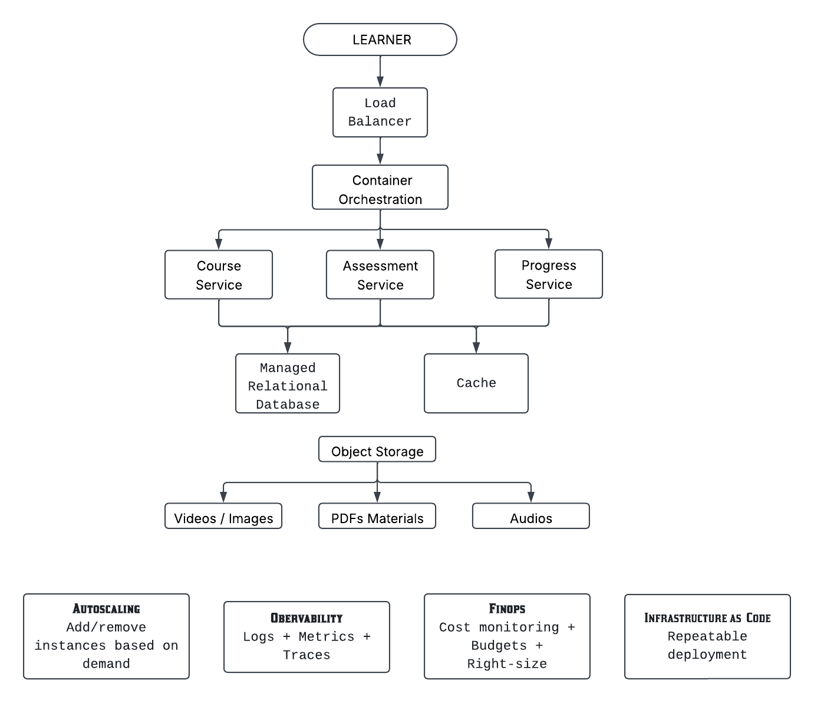

# Cloud Foundations – Online Learning Growth Challenge

## 1. Project Overview

This project analyzes the cloud infrastructure challenges faced by a growing online learning platform.

The platform allows learners to:

* Access online courses
* Complete assessments
* Track their learning progress

The platform performs well during normal usage. However, traffic increases significantly during exam periods, new course launches, and large corporate training programs.

These traffic variations can cause delays, while low-traffic periods can result in underutilized cloud resources and unnecessary costs.

The goal of this project is to propose a cloud-based solution that supports:

* Reliability
* Scalability
* Operational efficiency
* Observability
* Cost management

The architecture is **cloud-provider independent**. Generic cloud services are used to explain the concepts without depending on a specific service provider.

---

# 2. Problem Statement

The existing learning platform must support workloads that can change significantly over time.

For example:

### Normal Period

The platform may have a relatively small number of active learners.

### Exam Period

A large number of learners may start assessments at approximately the same time.

This can cause:

* Slow application responses
* Increased server load
* Delayed assessments
* Poor learner experience

### New Course Launch

A newly released course may suddenly receive a large number of requests for course information and learning materials.

### Corporate Training Program

A company may enroll thousands of learners, resulting in sustained increases in platform activity.

The architecture therefore needs to support changing workloads without permanently running the maximum amount of infrastructure.

---


# 3. Proposed Architecture


---

# 4. Load Balancer

## Problem

During high-demand periods, many users may send requests to the application simultaneously.

Sending all requests to one application instance could overload that instance.

## Solution

A load balancer distributes incoming requests across multiple available application instances.

```text
Users
  |
  v
Load Balancer
  |
  +----> Application 1
  |
  +----> Application 2
  |
  +----> Application 3
```

## Benefit

Load balancing helps:

* Distribute traffic
* Prevent one application instance from becoming overloaded
* Improve availability
* Support horizontal scaling

---

# 5. Containers

## Definition

A container packages an application together with the dependencies required to run it.

For example:

```text
Application
     +
Runtime
     +
Libraries
     +
Dependencies
     |
     v
  Container
```

## Why Containers?

Containers allow multiple consistent copies of an application to run.

For example:

```text
Container 1
Container 2
Container 3
Container 4
```

This makes application deployment and scaling easier.

## Benefit

Containers provide:

* Consistent deployment
* Isolation
* Portability
* Easier scaling

---

# 6. Container Orchestration

When the number of containers increases, manually managing them becomes difficult.

A container orchestration platform such as Kubernetes can help manage containerized workloads.

It can automate tasks such as:

* Deploying containers
* Scaling containers
* Restarting failed containers
* Managing networking
* Maintaining the desired application state

For this project, Kubernetes is one possible solution. A managed container platform could also be used if it provides the required capabilities with less operational overhead.

The architecture does not depend on a specific orchestration provider.

---

# 7. Autoscaling

## Definition

Autoscaling automatically increases or decreases computing resources based on workload demand.

This is particularly important for this platform because traffic changes significantly.

### Normal Period

```text
500 users
    |
    v
3 application instances
```

### Exam Period

```text
10,000 users
      |
      v
Autoscaling
      |
      v
8 application instances
```

### After the Exam

```text
Traffic decreases
      |
      v
Autoscaling
      |
      v
Fewer application instances
```

## Benefits

Autoscaling provides:

* Scalability during high demand
* Better resource utilization
* Reduced manual intervention
* Lower costs during low-demand periods

The key principle is:

> Scale out when demand increases and scale in when demand decreases.

---

# 8. Managed Cloud Services

A managed cloud service allows the cloud provider to handle much of the underlying infrastructure management.

For example, instead of managing a database server manually, the platform can use a managed relational database service.

```text
Application
     |
     v
Managed Relational Database
```

Other managed services can include:

* Managed relational databases
* Object storage
* Managed caching
* Managed monitoring and observability
* Managed container platforms

The cloud provider can handle many infrastructure-level responsibilities such as:

* Infrastructure maintenance
* Patching
* Backups
* Availability features
* Infrastructure management

## Benefit

Managed services reduce the operational workload on the engineering team.

This allows the team to focus more on the learning platform itself rather than managing infrastructure.

---

# 9. Object Storage

Large files such as videos, audio, PDFs, images, and course materials are better suited to object storage than a relational database.

```text
Application
     |
     v
Object Storage
     |
     +----> Videos
     +----> Audio
     +----> PDFs
     +----> Images
     +----> Course Materials
```

The relational database can store information about the files, while object storage keeps the actual large files.


## Benefit

Object storage provides a suitable way to store and manage large learning files separately from structured application data.

---

# 10. Cache

## Definition

A cache is temporary storage used to keep frequently accessed data so it can be retrieved faster.

For example, course information that is requested frequently can be stored in a cache.

```text
Learner
   |
   v
Application
   |
   v
Cache
   |
   +---- Cache Hit ----> Return data quickly
   |
   +---- Cache Miss ---> Database
```


## Benefit

Caching can:

* Reduce repeated database reads
* Improve response time
* Reduce database workload
* Improve application performance

The database remains the source of truth for persistent structured data.

---

# 11. Infrastructure as Code

## Definition

Infrastructure as Code (IaC) is the practice of defining and managing infrastructure using code or configuration files instead of creating infrastructure manually.
Tools such as Terraform or cloud-native IaC technologies can be used.

## Benefits

IaC provides:

* Consistency
* Repeatability
* Faster infrastructure deployment
* Reduced manual configuration
* Easier recovery
* Version-controlled infrastructure

For example:

```text
Infrastructure Definition
          |
          v
       IaC Tool
          |
          v
Cloud Infrastructure
```

The same infrastructure configuration can be used to reproduce environments consistently.

---

# 12. Observability

## Definition

Observability is the ability to understand the internal behavior and health of a system using the data it produces.

The three major pillars are:

```text
+----------------+
| Observability  |
+-------+--------+
        |
   +----+----+----+
   |         |    |
   v         v    v
 Logs     Metrics Traces
```

## Logs

Logs record events that happen inside the system.

Example:

```text
Successful action

10:15:20 INFO Course Service: Student 101 opened Course 25

→ Tells us when the student opened the course and that the request was successful.

Performance problem

10:50:30 WARN Assessment Service: Request took 5 seconds

→ Tells us the Assessment Service was slow, helping identify performance issues.

System error

10:46:02 ERROR Assessment Service: Database connection failed

→ Tells us where and what went wrong, helping the team diagnose the problem
```

## Metrics

Metrics are numerical measurements of system behavior.

Examples:

```text
CPU usage       = 75%
Memory usage    = 68%
Request latency = 850 ms
Error rate      = 2%
Requests/second = 2000
```

## Traces

Traces show how a request moves through different components.

Example:

```text
User
  |
  v
API
  |
  v
Authentication
  |
  v
Assessment Service
  |
  v
Database
```

If the request takes five seconds, tracing can help identify which component caused the delay.

## Benefit

Observability helps engineers:

* Detect problems
* Troubleshoot failures
* Identify bottlenecks
* Understand application performance
* Improve reliability

---


# 13. FinOps and Cost Management

## Definition

FinOps is a practice that combines financial accountability with cloud operations to understand, manage, and optimize cloud spending.

The platform's traffic changes significantly, so cost management is important.

## Cost Optimization Practices

### Autoscaling

Reduce resources during low-demand periods.

```text
Low demand
    |
    v
Fewer resources
    |
    v
Lower cost
```

### Right-Sizing

Use resources that match the actual workload.

For example, avoid using a very large compute resource when a smaller resource provides sufficient performance.

### Remove Unused Resources

Regularly identify and remove:

* Unused compute resources
* Unused storage
* Old resources
* Unnecessary development environments

### Budgets and Alerts

Set spending budgets and alerts to identify unexpected increases in cloud costs.

---
## Scenario 1: Normal Course Access

When a learner opens a course, the request goes through the load balancer to a Course Service container.

```text
Learner
   |
   v
Load Balancer
   |
   v
Course Service Container
   |
   v
Cache
```

### Cache hit

If the course information is already in the cache:

```text
Course Service
      |
      v
   Cache
      |
      v
Course information
      |
      v
   Learner
```

The Course Service returns the cached information quickly without querying the database.

### Cache miss

If the information is not available in the cache:

```text
Course Service
      |
      v
Cache miss
      |
      v
Database
      |
      v
Course information
```

The Course Service retrieves the data from the database, may place a copy in the cache, and returns it to the learner.

## Scenario 2: Learner Watches a Video

When a learner selects a lesson video, the application uses the course information to locate the file in object storage.

```text
Learner
   |
   v
Course Service
   |
   v
Object Storage
   |
   v
Video
```

The database stores structured information such as:

```text
Course information
Lesson information
Video name
File location
Access details
```

Object storage contains the large learning materials:

```text
Videos
Audio files
PDFs
Images
Datasets
```

Keeping metadata in the database and large files in object storage improves organization and scalability.

## Scenario 3: Learner Takes an Exam

When the learner starts an assessment:

```text
Learner
   |
   v
Load Balancer
   |
   v
Assessment Service
   |
   v
Database
   |
   v
Assessment Questions
```

When the learner submits answers:

```text
Learner
   |
   v
Assessment Service
   |
   v
Evaluate submission
   |
   v
Database
   |
   v
Result and Marks
```

The Assessment Service validates the answers, calculates the score, stores the result, and returns the result to the learner.

The service can then notify the Progress Service:

```text
Assessment Completed
          |
          v
Progress Service
          |
          v
Database
```

The Progress Service updates the learner's completion status or course percentage.

## Scenario 4: Exam-Period Scalability

During normal activity, the Assessment Service may run two containers.

```text
Normal activity: 2 containers
```

During an exam, thousands of learners may submit requests at the same time:

```text
Thousands of learners
          |
          v
Request volume increases
          |
          v
Assessment workload increases
          |
          v
Auto scaling
          |
          v
More containers
```

Example:

```text
2 containers
     |
     v
4 containers
     |
     v
8 containers
     |
     v
10 containers
```

The load balancer distributes requests across healthy containers. After the exam, traffic decreases and auto scaling can reduce the number of containers. This improves performance during peak demand and reduces unnecessary cost during quiet periods.

## Scenario 5: New Course Launch

When a new course becomes popular, many learners may request the same course information.

```text
Many learners
      |
      v
Load Balancer
      |
      v
Course Service
      |
      v
Cache
```

Frequently requested information can be served from the cache instead of repeatedly querying the database. If application workload increases significantly, the Course Service can scale to more containers.

This protects the database and prevents one application instance from becoming overloaded.


# 19. Mapping Problems to Solutions

| Business Problem | Proposed Solution | Expected Benefit |
|---|---|---|
| Traffic spikes | Autoscaling | Handles changing demand |
| Uneven traffic distribution | Load Balancer | Distributes requests |
| Application deployment complexity | Containers | Consistent deployment |
| Many containers to manage | Orchestration | Easier container management |
| Infrastructure management overhead | Managed Services | Reduced operational work |
| Manual infrastructure configuration | IaC | Consistency and repeatability |
| Difficult troubleshooting | Observability | Better visibility |
| High cloud costs | FinOps | Cost optimization |
| Single server failure | Multiple instances | Improved availability |
| Large learning files | Object Storage | Suitable scalable file storage |
| Repeated database reads | Cache | Faster access and reduced database load |

---


# 24. Conclusion

The Online Learning Growth Challenge requires a cloud solution that can adapt to changing demand while maintaining a reliable learner experience and controlling operational costs.

Our proposed approach combines:

```text
Load Balancing
       +
Containers
       +
Container Orchestration
       +
Autoscaling
       +
Managed Services
       +
Object Storage
       +
Caching
       +
Infrastructure as Code
       +
Observability
       +
FinOps
```

Autoscaling allows resources to increase during high-demand periods and decrease when demand falls. Load balancing and multiple application instances improve availability and distribute traffic. Containers and orchestration support consistent and scalable application deployment.

Managed services reduce infrastructure management responsibilities, while object storage provides a suitable location for large learning files and caching can reduce repeated database access.

Infrastructure as Code improves consistency and repeatability. Observability provides visibility into system behavior, while FinOps practices help control and optimize cloud spending.

Together, these practices provide a **scalable, reliable, observable, operationally efficient, and cost-conscious foundation** for the future growth of the online learning platform.

---
